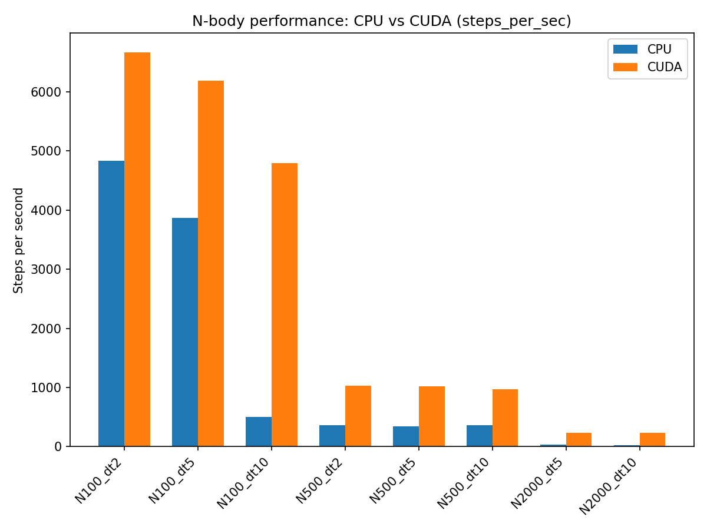
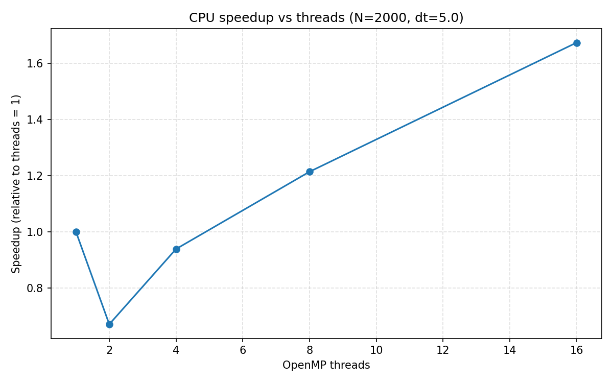
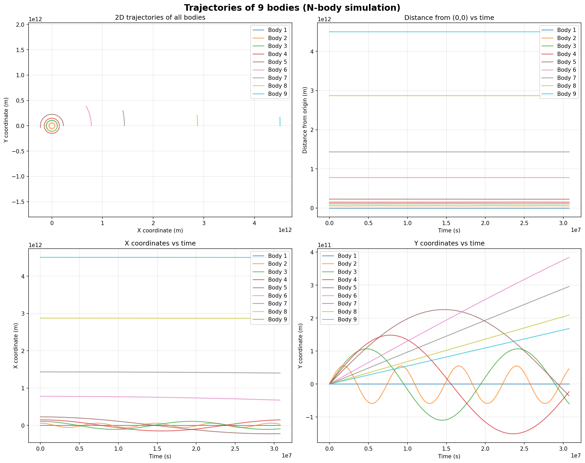

# Отчет по лабораторной работе №2
## Задание 2: Моделирование N-тел с использованием OpenMP и CUDA

### Постановка задачи

Требовалось разработать программу для моделирования гравитационного 
взаимодействия N материальных точек. 
Необходимо было реализовать два варианта решения: 
первый с использованием OpenMP для параллельных вычислений на CPU, 
второй с применением технологии CUDA для выполнения расчетов на GPU. 
Физическая модель для решения задачи основывается на 
законе всемирного тяготения,
а для численного интегрирования уравнений движения используется 
метод Эйлера первого порядка с учетом третьего закона Ньютона.

### Реализация
```
├── src/
│   ├── n_body_cpu.c              # OpenMP
│   └── n_body_cuda.cu            # CUDA
├── scripts/
│   ├── run_once.ps1              # Скрипт запуска одной конфигурации
│   ├── batch_run_task2.py        # Пакетный запуск тестов
│   ├── rebuild_task2.ps1         # Скрипт сборки проекта
│   ├── generate_random_inputs.py # Генератор тестовых данных
│   ├── plot_orbits.py            # Визуализация траекторий
│   └── plot_performance.py       # Построение графиков производительности
├── task2/
│   └── CMakeLists.txt            # Конфигурация сборки
├── data/
│   ├── config_n_body.json       # Конфигурация одиночного запуска
│   └── ....                      # Входные файлы для тестирования
```

#### CPU-версия (OpenMP)

**CPU-версия (OpenMP)** построена на распараллеливании трех ключевых этапов расчета: 
сброса сил `reset_forces()`, вычисления гравитационных сил `compute_forces()`
и шага интегрирования `euler_step()` по методу Эйлера. 
Для вычисления сил используется вложенный цикл по парам частиц 
с применением атомарных операций `#pragma omp atomic`, 
что позволяет корректно учесть третий закон Ньютона при работе в многопоточном режиме.
Динамическое распределение итераций 
`schedule(dynamic)` способствует балансировке нагрузки между потоками. 

Число используемых потоков контролируется переменной окружения `OMP_NUM_THREADS`.


#### GPU-версия (CUDA)

**GPU-версия (CUDA)** включает три основных ядра. 
Ядро `reset_forces_kernel` обнуляет силы, назначая по одному потоку на каждую частицу.
Ядро `compute_forces_kernel` реализует алгоритм вычисления парных взаимодействий, 
также используя атомарные операции для обеспечения корректности при параллельном 
доступе к силам. 
Ядро `euler_step_kernel` выполняет шаг интегрирования. 


**Конфигурация:**
- Размер блока: 256 потоков (или меньше в зависимости от аппаратных ограничений)
- Размер грида: `ceil(n / blockSize)`
- Использование событий CUDA для точного измерения времени

### Методика тестирования

Для проведения тестов был разработан скрипт `generate_random_inputs.py`, 
генерирующий три набора данных со 100, 500 и 2000 частицами.

Параметры генерации:
- Массы: 1.0e22 - 1.0e26 кг
- Координаты: ±1.0e11 м
- Скорости: ±3.0e4 м/с

Тестирование проводилось по двум основным направлениям. 
- Во-первых, оценивалась производительность CPU- и GPU-версий при различном количестве 
частиц (N) и разных шагах интегрирования (dt). 
- Во-вторых, исследовалось масштабирование CPU-версии в зависимости от числа 
потоков OpenMP (от 1 до 16) для случая с 2000 частиц.

Ключевой метрикой сравнения стала скорость вычислений,
выраженная в количестве шагов интегрирования, выполняемых за одну секунду.

Так же для проверки корректности подсчета задачи,
программа была скомилирована с реальными данными солнечной системы из 4/9 тел,
для симуляции движения которых был построен отдельный график.

### Визуализация

Для анализа результатов моделирования был создан скрипт `plot_orbits.py`. 
Он строит комплексный график, включающий двумерные траектории всех тел, 
графики изменения расстояния частиц от начала координат и графики изменения их 
координат по осям X и Y во времени. 
Это позволяет качественно оценить динамику системы.

Автоматизация анализа производительности реализована в скрипте `plot_performance.py`. 
Он генерирует сравнительные графики производительности CPU и GPU, 
исследует влияние шага интегрирования на скорость расчета
и визуализирует масштабируемость OpenMP-версии, включая графики ускорения.


### Результаты и анализ

Тестирование проводилось на системе с графическим процессором 
NVIDIA GeForce RTX 3070 Laptop GPU.

При моделировании системы из 100 объектов GPU-ускорение оказалось незначительным 
(всего 1.38 раза относительно CPU-версии на 16 потоках). 
Это объясняется преобладанием накладных расходов на организацию вычислений на 
GPU и передачу данных над самими расчетами. 
Однако с ростом сложности задачи преимущество GPU становилось все более выраженным. 
Для 500 частиц ускорение составило около 2.86 раза, 
а для 2000 частиц достигло 7.79 раза. 
Этот результат наглядно показывает, что архитектура GPU максимально 
раскрывает свой потенциал при обработке большого объема однотипных данных, 
позволяя эффективно распараллелить вычисления с квадратичной сложностью.



Исследование масштабируемости OpenMP-реализации для 2000 частиц выявило ее 
ограничения. Увеличение числа потоков с 1 до 16 привело к росту производительности 
лишь в 1.67 раза, что соответствует крайне низкой эффективности в 10.4%. 
Основными причинами являются необходимость использования атомарных операций 
при накоплении сил и связанные с этим затраты на синхронизацию, 
а также неидеальная балансировка нагрузки между потоками при динамическом 
распределении работы.



Солнечная система была построена корректно,
лишь с небольшими отклонениями. Симулируется один земной год.




### Выводы

GPU-реализация задачи N-тел демонстрирует существенное преимущество в
производительности для систем с большим количеством частиц,
что оправдывает использование CUDA в вычислительно интенсивных задачах.
В то же время, эффективность многопоточной CPU-версии ограничена из-за высоких затрат
на синхронизацию потоков.

Основными оптимизациями в реализованных алгоритмах стали учет третьего закона Ньютона,
сокращающий количество вычислений вдвое, и использование параметра сглаживания для
численной устойчивости. Примененный метод Эйлера обеспечивает приемлемую точность для
качественного анализа, но все же в нем есть погрешность.
